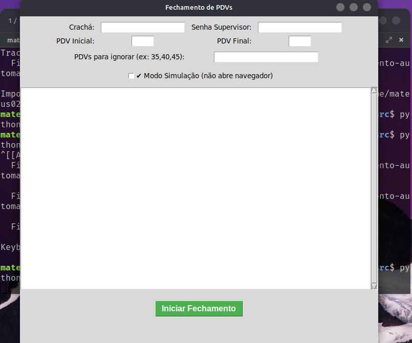

# 🏢 Automação Empresa – Controle de PDVs com Python

Automação de processos internos para o gerenciamento e controle de Pontos de Venda (PDVs) em uma rede corporativa. Este projeto foi desenvolvido para facilitar tarefas repetitivas através de uma interface gráfica simples e uso de automação via Selenium.


---

## 📌 Funcionalidades

- 🧠 **Automação Inteligente**: Automatiza ações repetitivas nos PDVs, ignorando máquinas fora do ar.
- 💻 **Interface Gráfica (Tkinter)**: Usabilidade simplificada com uma tela interativa.
- 🚀 **Execução Rápida em Lote**: Processa múltiplos PDVs em sequência.
- ⚠️ **Tratamento de Exceções**: Ignora PDVs específicos (como o 34) e prossegue sem travamentos.
- 🪪 **Login Automatizado**: Uso de Selenium para autenticação e execução remota.

---

## 🖼️ Demonstração



---

## 🛠️ Tecnologias utilizadas

- [Python 3.11+](https://www.python.org/)
- [Selenium](https://selenium-python.readthedocs.io/)
- [Tkinter](https://docs.python.org/3/library/tkinter.html)
- [ChromeDriver](https://sites.google.com/chromium.org/driver/)

---

## 📦 Instalação

Clone o projeto:

```bash
git clone https://github.com/soeiroo/automacao-empresa.git
cd automacao-empresa
```

Instale os requisitos:

```bash
pip install -r requirements.txt
```

Configure o caminho do `chromedriver` no sistema, se necessário.

---

## ▶️ Como usar

1. Execute o script principal com a interface:

```bash
python fechamento-automacaov2.py
```

2. Clique em **"Iniciar Automação"**.
3. O sistema passará por todos os PDVs (exceto os definidos como exceção, como o PDV 34).

---

## 📌 Exceções personalizadas

- PDVs podem ser excluídos do processo.
- O PDV **34** é ignorado automaticamente no script, por motivo de instabilidade.

---

## 🤝 Contribuições

Sinta-se livre para enviar pull requests ou abrir issues. Sugestões são bem-vindas!

---

## 📄 Licença

Distribuído sob a licença MIT. Veja `LICENSE` para mais informações.

---
